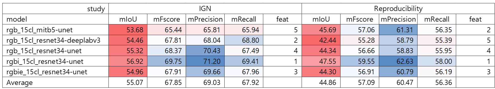
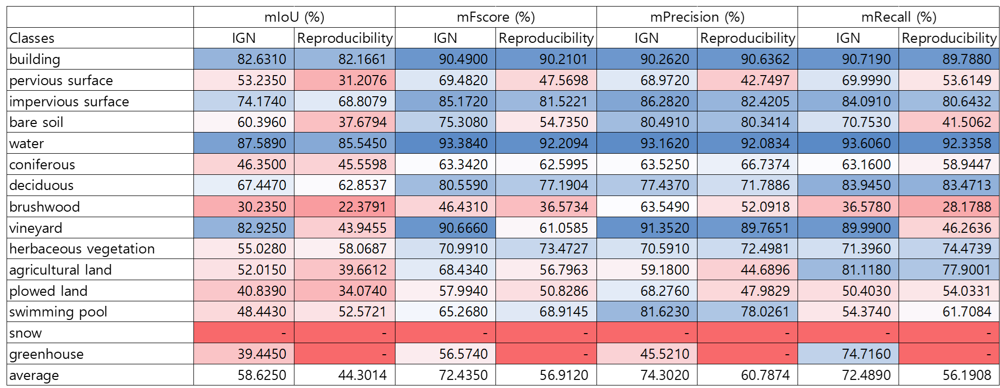
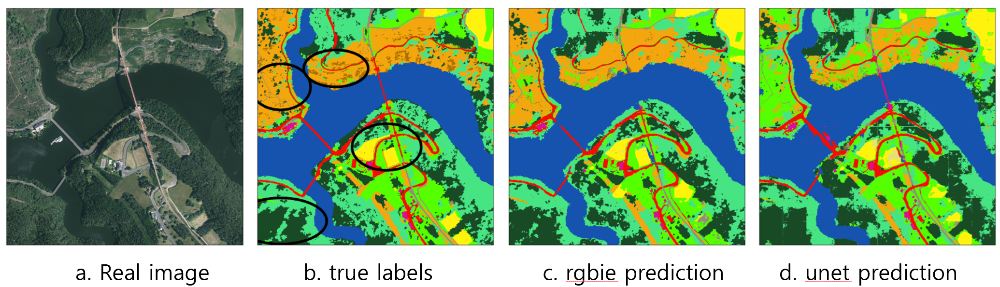

<div align="left">


# Reproducibility on FLAIR: a Country-Scale Land Cover Semantic Segmentation Dataset From Multi-Source Optical Imagery

- Team: HyeJung Moon, ShinHye Lee, YeJun Han
- Graduate School Of Public Policy and Information Technology
- Seoul National University of Science and Technology
- email: hyejung.moon@gmail.com, shinhye.lee@pawdly.com, yejun.han001224@gmail.com

This reproducibility is a study on the territory of France conducted by NeurIPS in 2023 by IGN (Geographical and Forest Information). For this study, IGN had geospatial experts hand-annotate more than 20 billion pixels using the nomenclature of 19 land cover classes (of which 15 were used in training). It was classified into 7 types according to the type of model data (RGBIE: natural color + infrared + altitude) and model (architecture: resnet34, deeplab, mit). As a result of learning, IoU performance was 54 56% depending on the model, and recall performance was 65 69% depending on the model. As a result of reproducibility, the actual performance was lower by an average of 8% compared to IGN, but overall recall performance was over 50%, so it is expected that it will be worth improving the model learned from Flair and applying it to Korean land.

### 1. Introduction
This reproducibility is a study on the French territory published in NeurIPS in 2023. IGN (Geographical and Forest Information) studied how forests are used according to time series to respond to climate change. IGAN classified the entire French territory into 15 uses. IoU was 54 to 56% depending on the model, and recall performance was 65 to 69% depending on the model. Although machine learning research on land has rarely been performed before, the performance is not relatively high, but the value of this research is very encouraging. Since Korea, where 65% of the entire country is forested, is also severely affected by climate change such as droughts, floods, and forest fires, it is considered highly valuable to develop it based on research conducted by IGN.
<br>

### 2. Scope of reproducibility
The paper to be reproduced is a study published by IGN that classified forests in France. IGN is the French National Institute of Geographical and Forest Information. IGN introduce the French Land cover from Aerospace ImageRy (FLAIR), an extensive dataset from IGN that provides a unique and rich resource for large-scale geospatial analysis. FLAIR contains high-resolution aerial imagery with a ground sample distance of 20 cm and over 20 billion individually labeled pixels for precise landcover classification. The dataset also integrates temporal and spectral data from optical satellite time series. FLAIR thus combines data with varying spatial, spectral, and temporal resolutions across over 817 km2 of acquisitions representing the full landscape diversity of France. This diversity makes FLAIR a valuable resource for the development and evaluation of novel methods for large-scale land-cover semantic segmentation and raises significant challenges in terms of computer vision, data fusion, and geospatial analysis. IGN also provides powerful uni- and multi-sensor baseline models that can be employed to assess algorithm’s performance and for downstream applications. Through its extent and the quality of its annotation, FLAIR aims to spur improvements in monitoring and understanding key anthropogenic development indicators such as urban growth, deforestation, and soil artificialization.

### 3 Methodology
##### 3.1 Model descriptions
IGN propose a generic yet powerful multi-sensor architecture to serve as a baseline to evaluate the semantic segmentation
performance of different approaches. IGN propose a network architecture named U-T&T(rgbie): U-net with Textural
and Temporal information. As shown in Figure 1, our model consists of two networks: one operating on high-resolution
images with four radiometric channels (red, green, blue, infrared) and one elevation channel, and one network operating
on time series. Each network follows the state-of-the-art approach for their respective data-source.
<p align="center">
  
  <br>
  <em>Figure 1. The U-T&T model architecture</em>
</p>

The baseline was implemented with PyTorch Lightning. The code for U-Net branch is taken from the segmentation43 models-PyTorch library, and the U-TAE network is from its official repository. We use the default U-TAE parameters, except for larger widths for the encoder and decoder The network is optimized with stochastic gradient descent, a batch size of 10, and a learning rate of 0.001. IGN set the maximum number of epochs to 200 and used early stopping with 30 epochs. IGN trained the models and released a synthesis of four additional models on Flair’s official site, in addition to the three benchmarked in the paper (U-Net, FPN, and DeepLabV3). Our team will train all seven models recently released by Flair through May 20, 2024, and compare their performance to the original benchmarking. We used phyCham as our implementation environment, and we used two GPUs (NVIDIA GeForce GTX 1660 super) to speed up the execution.
<be>

##### 3.2 Datasets
Our reproducibility introduces the French Land cover from Aerospace ImageRy (FLAIR), an extensive dataset from the French National Institute of Geographical and Forest Information (IGN) that provides a unique and rich resource for large-scale geospatial analysis. The FLAIR dataset consists of 77 762 patches represented in Figure 3. Each patch
includes a high-resolution aerial image of 0.2 m, a yearly satellite image time series with a spatial resolution of 10 m, and pixel-precise elevation and land cover annotations at 0.2 m resolution. As shown in Figure 5, the acquisitions are taken from 916 unique areas distributed across 50 French spatial domains (départements), covering approximately 817 km2. Aerial images were captured under favorable weather conditions between April and November from 2018 to 2021. Each satellite time series corresponds to the entire year of acquisition of the matching aerial image. in Figure 2. 
<p align="center">
  
  <br>
  <em>Figure 2. Satellite image of France (left), training and validation data (middle), and timeframe (right)</em>
</p>

Each pixel has been manually annotated by photo-interpretation of the 20 cm resolution aerial imagery, carried out by a team supervised by geography experts from the IGN. During the annotation process, we initially identified 18 classes. We group certain classes due to the rarity of certain classes, such as swimming pool, greenhouse, or snow, or potential ambiguity, as seen with ligneous and mixed vegetation. The resulting 12-class nomenclature leads to more statistically robust evaluation metrics. It consists of 512 x 512 patches with basic 15 as full semantic classes.
<p align="center">
  
  <br>
  <em>Table 1. Prediction results by land-cover class</em>
</p>

Each patch has 5 channels including RVB-Infrared-Elevation. The dataset also integrates temporal and spectral data from optical satellite time series. FLAIR thus combines data with varying spatial, spectral, and temporal resolutions across over 817 km2 of acquisitions representing the full landscape diversity of France in Figure 2. The dataset is comprised of 77,762 patches. Each patch contains (i) a 512 × 512 aerial image at 0.2m resolution with red, green, blue (RGB) and near-infrared (NIR) values, (ii) a pixel-precise digital surface model providing an elevation for each pixel, (iii) semantic labels for each pixel, and (iv) an optical time series of spatial dimension 40 × 40 and 10m per pixel,
centered on the aerial image.
<p align="center">
  
  <br>
  <em>Figure 3. Patches from FLAIR</em>
</p>


##### 3.3 Procedure and Hyperparameters
The sequences of reproducibility are as follows 
1. Download and place the program source and data source from the Flair official site according to our configuration
2. create a Flair project at pyCharm and install the Flair-recommended version of the package by customizing the environment.
3. install and configure CUDA for GPU use
4. configure a pipeline to use training, inference, and metric calculation using flair-1-config.yaml
5. flair-1-config-detect.yaml configuration settings for inferring pre-trained models at scale.
6. flair-1-config.yaml, flair-1-config-detect.yaml: change hyperparameters* and other setting** for 5 different models, set output directory and filename, and run benchmarking.
* hyperparameters: channels, norm_means, norm_stds, batch size, number of epochs
** setting: model architecture, encoder name, kinds of model, channels, bands, batch size, model name, encoder, norm means, norm stds

※ The distributed pre-trained models differ in their
− dataset for training : FLAIR dataset or the increased version of this dataset FLAIR-INC (x 3.5 patches). Only the
FLAIR dataset is open at the moment.
− input modalities : RGB (natural colours), RGBI (natural colours + infrared), RGBIE (natural colours + infrared +
elevation)
− model architecture : resnet34_unet (U-Net with a Resnet-34 encoder), deeplab, fpn, mit
− target class nomenclature : 15cl (15 land cover classes)

Among the models that classify French forests, the representative model is "rgbie_15cl_resnet34-unet". The "rgbie_15cl_resnet34-unet" model is a specialized classification model for French aerial images from the BD ORTHO® product, designed with specific spatial and radiometric specifications. It is optimized for input images normalized to  8-bit encoding per channel, with elevation information encoded in 8-bit format where each unit represents a 0.2-meter  elevation change. The model was trained using 218,400 patches of 512x512 pixels from the FLAIR-INC dataset, incorporating 75 radiometric domains to ensure robustness against domain shifts due to acquisition time, spatial domains, and radiometric processing. However, it is tailored to BD ORTHO images, and performance may drop when applied to other high-resolution images without transfer learning. Land cover classes include 19 categories, but 4 classes (Mixed, Ligneous, Other, Clear cut) were deactivated during training, so they should not appear in the final output. The model is sensitive to spatial resolution changes and is optimized for 0.2 meters resolution, with no augmentation for scale changes.
 
##### 3.4 Computational requirements
 The specifications of the computer that performed the reproduction are as follows. 
 - CPU: 13th Gen Intel(R) Core(TM) i9-13900 2.00 GHz
 - GPU: NVIDIA GeForce GTX 1660 super
 - Memory: 64GB
 - HDD: SSD - IDE: pyCharm
 - Python library: PyTorch (segmentation models)

<br>

### 4. Results
##### 4.1 Results of original paper vs reproducibility
The evaluation was performed on a TEST set that are independant from the TRAIN and VALIDATION patches. There are four performance evaluation criteria for each model: IoU, Fscore, Precision, and Recall. The results of comparing the research results of IGN and reproducibility for each of the five models are shown in Table 2.
<p align="center">
  
  <br>
  <em>Table 2. IGN study results (left) vs. Reproducibility study results (right)(unit: %)</em>
</p>


Overall, the performance of the models performed by IGN was similar, with an average IoU of 55.07%, an av119 erage Fscore of 67.85%, an average Precision of 69.03%, and an average Recall of 67.92%. In terms of model performance, rgbi_15cl_resnet34-unet had the highest recall at 69.41%, followed by rgb_15cl_resnet34-deeplabv3, rgbie_15cl_resnet34-unet, and rgb_15cl_resnet34-unet, and rgb_15cl_mitb5-unet had the lowest recall at 65.94%. On the other hand, the performance of the models performed by Reproducibility was on average 10% lower than
IGN. The performance of each model was confirmed by recall in the following order: rgbi_15cl_resnet34-unet, rgb_15cl_mitb5-unet, rgbie_15cl_resnet34-unet, rgb_15cl_resnet34unet, rgb_15cl_resnet34-deeplabv3.

##### 4.2 Performance comparison based on best model (IGN and reproducibility)
Table 3 shows the results of running the best performing rgbi_15cl_resnet34-unet model, separated by class, to compare IGN and reproducibility.
<p align="center">
  
  <br>
  <em>Table 3. IGN and Reproducibility’s rgbi_15cl_resnet34-unet land classification predictions</em>
</p>

The land was classified into 15 categories: building, pervious surface, impervious surface, bare soil, water, coniferous, deciduous, brushwood, vineyard, herbaceous vegetation, agricultural land, plowed land, swimming pool, snow, and greenhouse. The best prediction performance was for water, where both IGN and Reproducibiliy performed very well
with average recall of 93.61% and 92.34%, respectively. The biggest performance difference is vineyard, where IGN’s recall is 89.99%, while Reproducibiliy’s recall is 46.26%.

##### 4.3 Comparison between RGBIE and UNET, labeling the actual satellite
Figure 4 shows a comparison between RGBIE and UNET, labeling the actual satellite images and the results predicted by the learning model.
<p align="center">
  
  <br>
  <em>Table 3. IGN and Reproducibility’s rgbi_15cl_resnet34-unet land classification predictions</em>
</p>
Table 4. Qualitative illustration


##### 4.4 Results beyond original paper
Reproducibility means that 5 models, including 3 models released by NeurIPS as well as 2 models released by Flair, were reproduced. In particular, these five models are being continuously improved until May 30, 2024, so they have high potential for practical use as well as learning.

### 5 Discussion
The FLAIR dataset is limited to metropolitan France. Although France’s territory is quite diverse, featuring oceanic,continental, Mediterranean, and mountainous bioclimatic regions, it does not contain tropical or desert area. As anational agency, IGN’s focus is limited to France. However, similar efforts by other countries or agencies wouldincrease the diversity of available data and stimulate the design and evaluation of geographically robust methods.Releasing a large-scale, high-resolution land-cover dataset openly could raise potential concerns related to privacy,security, and possible misuse. Indeed, detailed information about private properties could be extracted, possibly aidingillegal activities. However, both aerial and satellite images are already publicly available, and we only provide visualinterpretations. Furthermore, high-risk areas such as military facilities and nuclear plants are explicitly excluded fromthe dataset. This is even more important in the case of South Korea, a country that is currently explicitly at war.However, applying such a model to South Korea, which has seen a surge in forest fires and floods due to the effectsof climate change, could help prevent and respond to natural disasters faster, especially since France is located at thesame latitude as South Korea, and the four seasons change at the same time. An unusual aspect of IGN’s study is that itcategorized France’s specialty as vineyards.

##### 5.1 What was easyIGN provides a toy set of pre-trained models, real-world Flair data, and training data on their official website, whichhas been continuously updated until recently (May 2024). Therefore, we were able to perform and test reproducibilityusing the toy set relatively quickly.
##### 5.2 What was difficult
List part of the reproduction study that took more time than you anticipated or you felt were difficult.Be careful to put your discussion in context. For example, don’t say "the maths was difficult to follow", say "the mathrequires advanced knowledge of calculus to follow".

##### 5.3 Future Task
The data was 85 GB in size, and it took a long time to download and was frequently interrupted. I had to changehyperparameters and model and result file paths for each model, but it wasn’t explained, so it was difficult to verifyit manually. Also, it was difficult to modify the model name, architecture, encoder, batch size, etc. in the programsource every time I changed the model. Finally, the paper published by NeurIPS analyzed only three models, but thereare seven models available on the Flair website, and two of them are not executed with open source, which was verydisappointing.

### References
Garioud, A., Gonthier, N., Landrieu, L., De Wit, A., Valette, M., Poupée, M., & Giordano, S. (2024). FLAIR: aCountry-Scale Land Cover Semantic Segmentation Dataset From Multi-Source Optical Imagery. Advances in NeuralInformation Processing Systems, 36.

```bibtex
@article{garioud2022flair1,
  doi = {10.13140/RG.2.2.30183.73128/1},
  url = {https://arxiv.org/pdf/2211.12979.pdf},
  author = {Garioud, Anatol and Peillet, Stéphane and Bookjans, Eva and Giordano, Sébastien and Wattrelos, Boris},
  title = {FLAIR #1: semantic segmentation and domain adaptation dataset},
  publisher = {arXiv},
  year = {2022}
}
```

