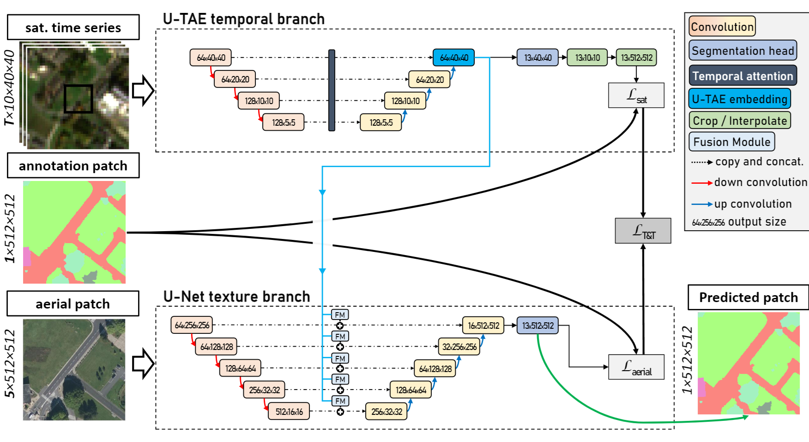
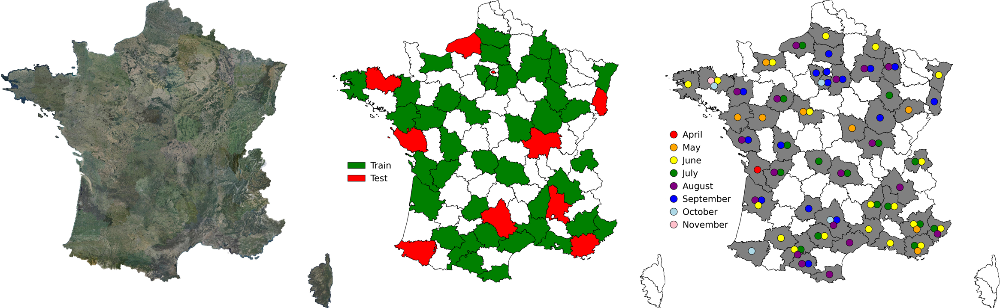
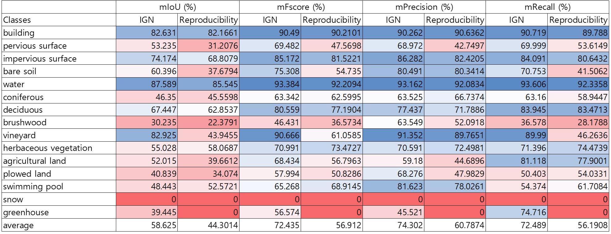
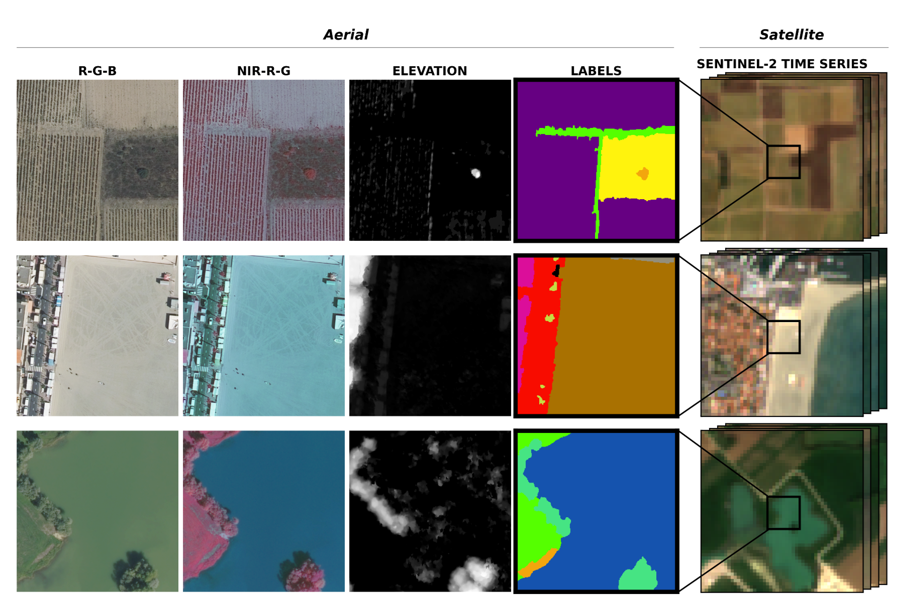
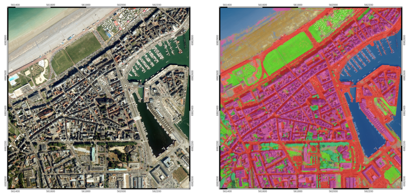
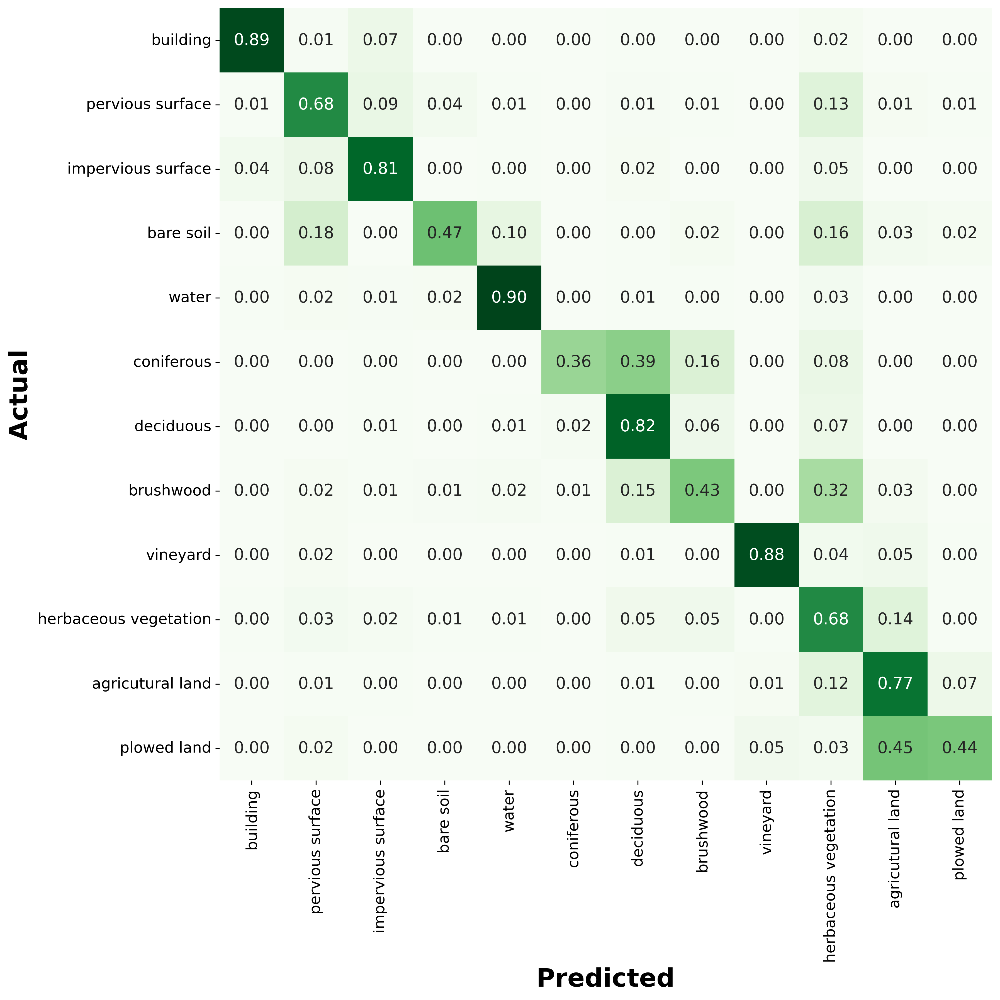

<div align="left">


# Reproducibility on FLAIR: a Country-Scale Land Cover Semantic Segmentation Dataset From Multi-Source Optical Imagery

- Team: HyeJung Moon, ShinHye Lee, YeJun Han
- Graduate School Of Public Policy and Information Technology
- Seoul National University of Science and Technology
- email: hyejung.moon@gmail.com, shinhye.lee@pawdly.com, yejun.han001224@gmail.com

This reproducibility is a study on the territory of France conducted by NeurIPS in 2023 by IGN (Geographical and Forest Information). For this study, IGN had geospatial experts hand-annotate more than 20 billion pixels using the nomenclature of 19 land cover classes (of which 15 were used in training). It was classified into 7 types according to the type of model data (RGBIE: natural color + infrared + altitude) and model (architecture: resnet34, deeplab, mit). As a result of learning, IoU performance was 54 56% depending on the model, and recall performance was 65 69% depending on the model. As a result of reproducibility, the actual performance was lower by an average of 8% compared to IGN, but overall recall performance was over 50%, so it is expected that it will be worth improving the model learned from Flair and applying it to Korean land.

### 1. Introduction
This reproducibility is a study on the French territory published in NeurIPS in 2023. IGN (Geographical and Forest Information) studied how forests are used according to time series to respond to climate change. IGAN classified the entire French territory into 15 uses. IoU was 54 to 56% depending on the model, and recall performance was 65 to 69% depending on the model. Although machine learning research on land has rarely been performed before, the performance is not relatively high, but the value of this research is very encouraging. Since Korea, where 65% of the entire country is forested, is also severely affected by climate change such as droughts, floods, and forest fires, it is considered highly valuable to develop it based on research conducted by IGN.
<br>

### 2. Scope of reproducibility
The paper to be reproduced is a study published by IGN that classified forests in France. IGN is the French National Institute of Geographical and Forest Information. IGN introduce the French Land cover from Aerospace ImageRy (FLAIR), an extensive dataset from IGN that provides a unique and rich resource for large-scale geospatial analysis. FLAIR contains high-resolution aerial imagery with a ground sample distance of 20 cm and over 20 billion individually labeled pixels for precise landcover classification. The dataset also integrates temporal and spectral data from optical satellite time series. FLAIR thus combines data with varying spatial, spectral, and temporal resolutions across over 817 km2 of acquisitions representing the full landscape diversity of France. This diversity makes FLAIR a valuable resource for the development and evaluation of novel methods for large-scale land-cover semantic segmentation and raises significant challenges in terms of computer vision, data fusion, and geospatial analysis. IGN also provides powerful uni- and multi-sensor baseline models that can be employed to assess algorithm’s performance and for downstream applications. Through its extent and the quality of its annotation, FLAIR aims to spur improvements in monitoring and understanding key anthropogenic development indicators such as urban growth, deforestation, and soil artificialization.

### 3 Methodology
##### 3.1 Model descriptions
IGN propose a generic yet powerful multi-sensor architecture to serve as a baseline to evaluate the semantic segmentation
performance of different approaches. IGN propose a network architecture named U-T&T(rgbie): U-net with Textural
and Temporal information. As shown in Figure 1, our model consists of two networks: one operating on high-resolution
images with four radiometric channels (red, green, blue, infrared) and one elevation channel, and one network operating
on time series. Each network follows the state-of-the-art approach for their respective data-source.
<p align="center">
  
  <br>
  <em>Figure 1. The U-T&T model architecture</em>
</p>

The baseline was implemented with PyTorch Lightning. The code for U-Net branch is taken from the segmentation43 models-PyTorch library, and the U-TAE network is from its official repository. We use the default U-TAE parameters, except for larger widths for the encoder and decoder The network is optimized with stochastic gradient descent, a batch size of 10, and a learning rate of 0.001. IGN set the maximum number of epochs to 200 and used early stopping with 30 epochs. IGN trained the models and released a synthesis of four additional models on Flair’s official site, in addition to the three benchmarked in the paper (U-Net, FPN, and DeepLabV3). Our team will train all seven models recently released by Flair through May 20, 2024, and compare their performance to the original benchmarking. We used phyCham as our implementation environment, and we used two GPUs (NVIDIA GeForce GTX 1660 super) to speed up the execution.
<be>

##### 3.2 Datasets
Our reproducibility introduces the French Land cover from Aerospace ImageRy (FLAIR), an extensive dataset from the French National Institute of Geographical and Forest Information (IGN) that provides a unique and rich resource for large-scale geospatial analysis. The FLAIR dataset consists of 77 762 patches represented in Figure 3. Each patch
includes a high-resolution aerial image of 0.2 m, a yearly satellite image time series with a spatial resolution of 10 m, and pixel-precise elevation and land cover annotations at 0.2 m resolution. As shown in Figure 5, the acquisitions are taken from 916 unique areas distributed across 50 French spatial domains (départements), covering approximately 817 km2. Aerial images were captured under favorable weather conditions between April and November from 2018 to 2021. Each satellite time series corresponds to the entire year of acquisition of the matching aerial image. in Figure 2. 
<p align="center">
  
  <br>
  <em>Figure 2. Satellite image of France (left), training and validation data (middle), and timeframe (right)</em>
</p>

Each pixel has been manually annotated by photo-interpretation of the 20 cm resolution aerial imagery, carried out by a team supervised by geography experts from the IGN. During the annotation process, we initially identified 18 classes. We group certain classes due to the rarity of certain classes, such as swimming pool, greenhouse, or snow, or potential ambiguity, as seen with ligneous and mixed vegetation. The resulting 12-class nomenclature leads to more statistically robust evaluation metrics. It consists of 512 x 512 patches with basic 15 as full semantic classes.
<p align="center">
  
  <br>
  <em>Table 1. Prediction results by land-cover class</em>
</p>

Each patch has 5 channels including RVB-Infrared-Elevation. The dataset also integrates temporal and spectral data from optical satellite time series. FLAIR thus combines data with varying spatial, spectral, and temporal resolutions across over 817 km2 of acquisitions representing the full landscape diversity of France in Figure 2. The dataset is comprised of 77,762 patches. Each patch contains (i) a 512 × 512 aerial image at 0.2m resolution with red, green, blue (RGB) and near-infrared (NIR) values, (ii) a pixel-precise digital surface model providing an elevation for each pixel, (iii) semantic labels for each pixel, and (iv) an optical time series of spatial dimension 40 × 40 and 10m per pixel,
centered on the aerial image.
<p align="center">
  
  <br>
  <em>Figure 3. Patches from FLAIR</em>
</p>


##### 3.3 Procedure and Hyperparameters
The sequences of reproducibility are as follows 
1. Download and place the program source and data source from the Flair official site according to your configuration
2. create a Flair project at pyCharm and install the Flair-recommended version of the package by customizing the environment.
3. install and configure CUDA for GPU use
4. configure a pipeline to use training, inference, and metric calculation using flair-1-config.yaml
5. flair-1-config-detect.yaml configuration settings for inferring pre-trained models at scale.
6. flair-1-config.yaml, flair-1-config-detect.yaml: change hyperparameters* and other setting** for 5 different models, set output directory and filename, and run benchmarking.
* hyperparameters: channels, norm_means, norm_stds, batch size, number of epochs
** setting: model architecture, encoder name, kinds of model, channels, bands, batch size, model name, encoder, norm means, norm stds

※ The distributed pre-trained models differ in their
− dataset for training : FLAIR dataset or the increased version of this dataset FLAIR-INC (x 3.5 patches). Only the
FLAIR dataset is open at the moment.
− input modalities : RGB (natural colours), RGBI (natural colours + infrared), RGBIE (natural colours + infrared +
elevation)
− model architecture : resnet34_unet (U-Net with a Resnet-34 encoder), deeplab, fpn, mit
− target class nomenclature : 15cl (15 land cover classes)
Among the models that classify French forests, the representative model is "rgbie_15cl_resnet34-unet". The
"rgbie_15cl_resnet34-unet" model is a specialized classification model for French aerial images from the BD ORTHO®
product, designed with specific spatial and radiometric specifications. It is optimized for input images normalized to
 8-bit encoding per channel, with elevation information encoded in 8-bit format where each unit represents a 0.2-meter
 elevation change. The model was trained using 218,400 patches of 512x512 pixels from the FLAIR-INC dataset,
 incorporating 75 radiometric domains to ensure robustness against domain shifts due to acquisition time, spatial
 domains, and radiometric processing. However, it is tailored to BD ORTHO images, and performance may drop when
 applied to other high-resolution images without transfer learning. Land cover classes include 19 categories, but 4 classes
 (Mixed, Ligneous, Other, Clear cut) were deactivated during training, so they should not appear in the final output. The
 model is sensitive to spatial resolution changes and is optimized for 0.2 meters resolution, with no augmentation for
 scale changes.
 ##### 3.4 Computational requirements
 The specifications of the computer that performed the reproduction are as follows. - CPU: 13th Gen Intel(R) Core(TM)
 i9-13900 2.00 GHz - GPU: NVIDIA GeForce GTX 1660 super - Memory: 64GB - HDD: SSD - IDE: pyCharm -
 Python library: PyTorch (segmentation models)

<br>


## Baseline model 

A U-Net architecture with a pre-trained ResNet34 encoder from the pytorch segmentation models library is used for the baselines. The used architecture allows integration of patch-wise metadata information and employs commonly used image data augmentation techniques. It has about 24.4M parameters and it is implemented using the _segmentation-models-pytorch_ library. The results are evaluated with an Intersection Over Union (IoU) metric and a single mIoU is reported (see associated datapaper).

The _metadata_ strategy refers encoding metadata with a shallow MLP and concatenate this encoded information to the U-Net encoder output. The _augmentation_ strategy employs three typical geometrical augmentations (see associated datapaper).


Example of a semantic segmentation of an urban and coastal area in the D076 spatial
domain, obtained with the baseline trained model:


<p align="center">
  
  <br>
  <em>Example of a semantic segmentation result using the baseline model.</em>
</p>


<br>

## Pre-trained models

<b>Pre-trained models &#9889;</b> with different modalities and architectures are available as a IGNF's HuggingFace collection here : <a href="https://huggingface.co/collections/IGNF/flair-models-landcover-semantic-segmentation-65bb67415a5dbabc819a95de">huggingface.co/collections/IGNF/flair-models-landcover-semantic-segmentation</a> <br>
See datacards for more details about each model. 

<br>

## Lib usage 

<br><br>

### Installation :pushpin:

```bash
# it's recommended to install on a conda virtual env
conda create -n my_env_name -c conda-forge python=3.11.6
conda activate my_env_name
git clone git@github.com:IGNF/FLAIR-1.git
cd FLAIR-1*
pip install -e .
# if torch.cuda.is_available() returns False, do the following :
# pip install torch==2.0.0 --extra-index-url=https://download.pytorch.org/whl/cu117

```

<br><br>

### Tasks :mag_right:

This library comprises two main entry points:<br>

#### :file_folder: flair

The flair module is used for training, inference and metrics calculation at the patch level. To use this pipeline :

```bash
flair --conf=/my/conf/file.yaml
```
This will perform the tasks specified in the configuration file. If ‘train’ is enabled, it will train the model and save the trained model to the output folder. If ‘predict’ is enabled, it will load the trained model (or a specified checkpoint if ‘train’ is not enabled) and perform prediction on the test data. If ‘metrics’ is enabled, it will calculate the mean Intersection over Union (mIoU) and other IoU metrics for the predicted and ground truth masks.
A toy dataset (reduced size) is available to check that your installation and the information in the configuration file are correct.
Note: A notebook is available in the legacy-torch branch (which uses different libraries versions and structure) that was used during the challenge.

#### :file_folder: zone_detect
This module aims to infer a pre-trained model at a larger scale than individual patches. It allows overlapping inferences using a margin argument. Specifically, this module expects a single georeferenced TIFF file as input.

```bash
flair-detect --conf=/my/conf/file-detect.yaml
```

<br><br>

### Configuration for flair :page_facing_up:

The pipeline is configured using a YAML file (`flair-1-config.yaml`). The configuration file includes sections for data paths, tasks, model configuration, hyperparameters and computational resources.

`out_folder`: The path to the output folder where the results will be saved.<br>
`out_model_name`: The name of the output model.<br>
`train_csv`: Path to the CSV file containing paths to image-mask pairs for training.<br>
`val_csv`: Path to the CSV file containing paths to image-mask pairs for validation.<br>
`test_csv`: Path to the CSV file containing paths to image-mask pairs for testing.<br>
`ckpt_model_path`: The path to the checkpoint file of the model for prediction if train is disabled.<br>

`train`: If set to True, the model will be trained.<br>
`train_load_ckpt`: Initialize model with given weights.<br><br>
`predict`: If set to True, predictions will be made using the model.<br>
`metrics`: If set to True, metrics will be calculated.<br>
`delete_preds`: Remove prediction files after metrics calculation.<br><br>

`model_architecture`: The architecture of the model to be used (e.g., ‘unet’).<br>
`encoder_name`: The name of the encoder to be used in the model (e.g., ‘resnet34’).<br>
`use_augmentation`: If set to True, data augmentation will be applied during training.<br>

`use_metadata`: If set to True, metadata will be used. If other than the FLAIR dataset, see structure to be provided.<br>
`path_metadata_aerial`: The path to the aerial metadata JSON file.<br><br>

`channels`: The channels opened in your input images. Images are opened with rasterio which starts at 1 for the first channel.<br>
`seed`: The seed for random number generation to ensure reproducibility.<br><br>

`batch_size`: The batch size for training.<br>
`learning_rate`: The learning rate for training.<br>
`num_epochs`: The number of epochs for training.<br><br>

`use_weights`: If set to True, class weights will be used during training.<br>
`classes`: Dict of semantic classes with value in images as key and list [weight, classname] as value. See config file for an example.<br>

`norm_type`: Normalization to be applied: scaling (linear interpolation in the range [0,1]), custom (center-reduced with provided means and standard deviantions), without.<br>
`norm_means`: If custom, means for each input band.<br>
`norm_stds`: If custom standard deviation for each input band.<br><br>

`georeferencing_output`: If set to True, the output will be georeferenced.<br><br>

`accelerator`: The type of accelerator to use (‘gpu’ or ‘cpu’).<br>
`num_nodes`: The number of nodes to use for training.<br>
`gpus_per_node`: The number of GPUs to use per node for training.<br>
`strategy`: The strategy to use for distributed training (‘auto’,‘ddp’,...).<br>
`num_workers`: The number of workers to use for data loading.<br><br>

`cp_csv_and_conf_to_output`: Makes a copy of paths csv and config file to the output directory.<br>
`enable_progress_bar`: If set to True, a progress bar will be displayed during training and inference.<br>
`progress_rate`: The rate at which progress will be displayed.<br>

<br><br>

### Configuration for zone_detect :page_facing_up:

The pipeline is configured using a YAML file (`flair-1-config-detect.yaml`).

`output_path`: path to output result.<br>
`output_name`: name of resulting raster.<br><br>

`input_img_path` : path to georeferenced raster.<br>
`bands` : bands to be used in your raster file.<br><br>

`img_pixels_detection` : size in pixels of infered patches, default is 512.<br>
`margin` : margin between patchs for overlapping detection. 128 by exemple means that every 128*resolution step, a patch center will be computed.<br>
`output_type` : type of output, can be "class_prob" for integer between 0 and 255 representing the output of the model or "argmax" which will output only one band with the index of the class.<br>
`n_classes` : number of classes.<br><br>

`model_weights` : path to your model weights or checkpoint.<br>
`batch_size` : size of batch in dataloader, default is 2.<br> 
`use_gpu` : boolean, rather use gpu or cpu for inference, default is true.<br>
`model_name` : name of the model in pytorch segmentation models, default is 'unet'.<br>
`encoder_name` :  Name of the encoder from pytorch segmentation model, default is 'resnet34'.<br>
`num_worker` : number of worker used by dataloader, value should not be set at a higher value than 2 for linux because paved detection can have concurrency issues compared with traditional detection and set to 0 for mac and windows (gdal implementation's problem).<br><br>

`write_dataframe` : wether to write the dataframe of raster slicing to a file.<br><br>

`norm_type`: Normalization to be applied: scaling (linear interpolation in the range [0,1]) or custom (center-reduced with provided means and standard deviantions).<br>
`norm_means`: If custom, means for each input band.<br>
`norm_stds`: If custom standard deviation for each input band.<br><br>

<br><br>

## Leaderboard

| Model | mIoU 
------------ | ------------- 
| baseline U-Net (ResNet34) | 0.5443±0.0014
| baseline U-Net (ResNet34) + _metadata + augmentation_ | 0.5570±0.0027

If you want to submit a new entry, you can open a new issue.
<b> Results of the challenge will be reported soon! </b>

The baseline U-Net with ResNet34 backbone obtains the following confusion matrix: 


<p>
  
  <br>
  <em>Baseline confusion matrix of the test dataset normalized by rows.</em>
</p>


## Reference
Please include a citation to the following article if you use the FLAIR #1 dataset:

```bibtex
@article{garioud2022flair1,
  doi = {10.13140/RG.2.2.30183.73128/1},
  url = {https://arxiv.org/pdf/2211.12979.pdf},
  author = {Garioud, Anatol and Peillet, Stéphane and Bookjans, Eva and Giordano, Sébastien and Wattrelos, Boris},
  title = {FLAIR #1: semantic segmentation and domain adaptation dataset},
  publisher = {arXiv},
  year = {2022}
}
```

## Acknowledgment
This work was performed using HPC/AI resources from
GENCI-IDRIS (Grant 2022-A0131013803).

## Dataset license

The "OPEN LICENCE 2.0/LICENCE OUVERTE" is a license created by the French government specifically for the purpose of facilitating the dissemination of open data by public administration. 
If you are looking for an English version of this license, you can find it on the official GitHub page at the [official github page](https://github.com/etalab/licence-ouverte).

As stated by the license :

### Applicable legislation

This licence is governed by French law.

### Compatibility of this licence

This licence has been designed to be compatible with any free licence that at least requires an acknowledgement of authorship, and specifically with the previous version of this licence as well as with the following licences: United Kingdom’s “Open Government Licence” (OGL), Creative Commons’ “Creative Commons Attribution” (CC-BY) and Open Knowledge Foundation’s “Open Data Commons Attribution” (ODC-BY).
